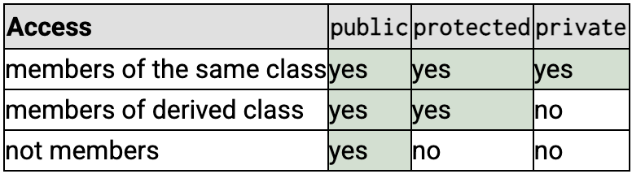

**Inheritance**

It's a way to factorize behaviors.
A class (derived) can inherit attributes and methods from another class (base).

In C++, there is 5 types of inheritances:

- Single inheritance (ex01 & ex02)
- Multilevel inheritance (ex03 - Diamond Problem)
- Multiple inheritance
- Hierarchical inheritance
- Hybrid inheritance

### `protected`
New encapsulation level that will only be used for heritage. It's similar to `private`, but unlike `pritave`, it allows the derived classes to have access to the protected members while still denying access to them outside the class.

### ex03 - Diamond Problem
Ambiguities are caused because the grandparent class will have to copies.

`virtual` keyword fixes the issue.